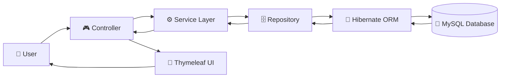

<div align="center">

# 🎬 Movie Ticket Management System

### 🍿 Book • Explore • Experience Movies Effortlessly


<br>


</div>

---

# 🌟 Overview

The **Movie Ticket Management System** is a modern full-stack web application inspired by real-world cinema booking platforms. It allows users to browse movies, explore theatres, check show timings, book tickets, and manage reservations through a clean and responsive interface.

The application follows the **Spring Boot MVC Architecture** with a layered backend, making it scalable, maintainable, and easy to extend.

---

# 🚀 Project Highlights

- 🎬 Complete Movie Booking Platform
- 👤 User Registration & Authentication
- 🏢 Theatre Management
- 🎟 Ticket Booking System
- 💺 Seat Availability Management
- 📅 Show Scheduling
- ⚙️ Admin Dashboard
- 📦 Layered MVC Architecture
- 🔄 CRUD Operations
- 🗄 MySQL Database Integration
- 📱 Responsive Bootstrap UI
- 🧩 Clean Code Structure

---

# ✨ Features

## 👤 User Module

- Register New Account
- Login Authentication
- Browse Movies
- View Movie Details
- Explore Theatres
- Check Show Timings
- Book Tickets
- View Booking History

---

## 🎬 Movie Module

- Add Movies
- Update Movie Details
- Delete Movies
- View Movie List

---

## 🏢 Theatre Module

- Add Theatre
- Update Theatre
- Delete Theatre
- Manage Theatre Information

---

## 🎟 Show Module

- Create Shows
- Update Show Timings
- Manage Available Seats
- View Show Schedule

---

## ⚙️ Admin Module

- Manage Movies
- Manage Theatres
- Manage Shows
- Manage Bookings
- Monitor System Data

---

# 🏗 System Architecture



---

# 🛠 Tech Stack

| Category | Technologies |
|-----------|--------------|
| Language | Java 17 |
| Backend | Spring Boot, Spring MVC |
| ORM | Hibernate |
| Data Access | Spring Data JPA |
| Frontend | HTML5, CSS3, Bootstrap 5, Thymeleaf |
| Database | MySQL |
| Build Tool | Maven |
| IDE | Eclipse IDE |
| Version Control | Git & GitHub |

---

# 📂 Project Structure

```
MovieTicketManagement
│
├── src
│   ├── controller
│   ├── entity
│   ├── repository
│   ├── service
│   ├── serviceimpl
│   ├── dto
│   ├── exception
│   ├── config
│   └── resources
│       ├── static
│       └── templates
│
├── pom.xml
├── mvnw
├── mvnw.cmd
└── README.md
```

---

# ⚙️ Installation Guide

### Clone Repository

```bash
git clone https://github.com/Lok997/movie-ticket-management-system-springboot.git
```

### Open Project

```bash
cd movie-ticket-management-system-springboot
```

### Configure Database

Update your **application.properties**

```properties
spring.datasource.url=jdbc:mysql://localhost:3306/movie_ticket_db
spring.datasource.username=your_username
spring.datasource.password=your_password
```

### Run Application

```bash
mvn spring-boot:run
```

Open your browser:

```
http://localhost:8080
```

---

# 📸 Project Screenshots

> Add screenshots of your application here.


> 


---

# 🚀 Future Enhancements

- 💳 Online Payment Gateway
- 📷 QR Code Ticket Generation
- 📧 Email Notifications
- ⭐ Ratings & Reviews
- 🔍 Advanced Movie Search
- 🎯 Interactive Seat Selection
- 🌙 Dark Mode
- 📱 Mobile Responsive Improvements

---

# 📚 Learning Outcomes

Through this project, I strengthened my understanding of:

- Spring Boot Development
- MVC Architecture
- Spring Data JPA
- Hibernate ORM
- CRUD Operations
- Thymeleaf Integration
- MySQL Database Design
- Exception Handling
- Layered Architecture
- Git & GitHub Workflow
- Maven Project Management

---

# 👨‍💻 Developer

## Lokesh Chaudhari

**Aspiring Java Backend Developer | Spring Boot Developer | Full Stack Java Learner**

📧 Email: **lokeshchaudhari997@gmail.com**

🔗 GitHub: **https://github.com/Lok997**

---

<div align="center">

## ⭐ If you found this project helpful, please consider giving it a Star!

**Thank you for visiting this repository. Happy Coding! 🚀**

</div>
